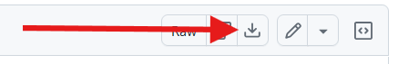
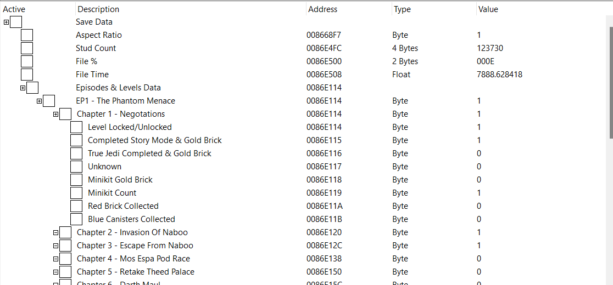

# LEGO Star Wars: The Complete Saga save file documentation

Documentation of save file format of LEGO Star Wars: The Complete Saga.

## How to Use

Download the [LSWTCS_Save_Data.CT](./LSWTCS_Save_Data.CT) file. You can use the "Download raw file" button:

Launch the game and load your save game.

Open up the file in Cheat Engine and attach to LEGOStarWarsSaga.exe. If you're playing the Steam version of the game, you're done!

If you're playing the GOG version of the game, right-click "Stud Count" in the table and choose "Recalculate new addresses" in the menu. In the "Change to address" tab, type in `0086e4fc` and click OK. (this might also work for other versions of the game, but I haven't tested them.) This moves all the table entries to their proper memory position.

## Example of what's included

## Credit and License

The Cheat Engine table was not made by me - it was built by Polly and archived at https://github.com/PollyThePancake/LSW-SE/blob/main/Research/LSWTCS_Save_Data.CT under the MIT License.

MIT License

Copyright (c) 2024 Polly May

Permission is hereby granted, free of charge, to any person obtaining a copy of this software and associated documentation files (the “Software”), to deal in the Software without restriction, including without limitation the rights to use, copy, modify, merge, publish, distribute, sublicense, and/or sell copies of the Software, and to permit persons to whom the Software is furnished to do so, subject to the following conditions:

The above copyright notice and this permission notice shall be included in all copies or substantial portions of the Software.

THE SOFTWARE IS PROVIDED “AS IS”, WITHOUT WARRANTY OF ANY KIND, EXPRESS OR IMPLIED, INCLUDING BUT NOT LIMITED TO THE WARRANTIES OF MERCHANTABILITY, FITNESS FOR A PARTICULAR PURPOSE AND NONINFRINGEMENT. IN NO EVENT SHALL THE AUTHORS OR COPYRIGHT HOLDERS BE LIABLE FOR ANY CLAIM, DAMAGES OR OTHER LIABILITY, WHETHER IN AN ACTION OF CONTRACT, TORT OR OTHERWISE, ARISING FROM, OUT OF OR IN CONNECTION WITH THE SOFTWARE OR THE USE OR OTHER DEALINGS IN THE SOFTWARE.
